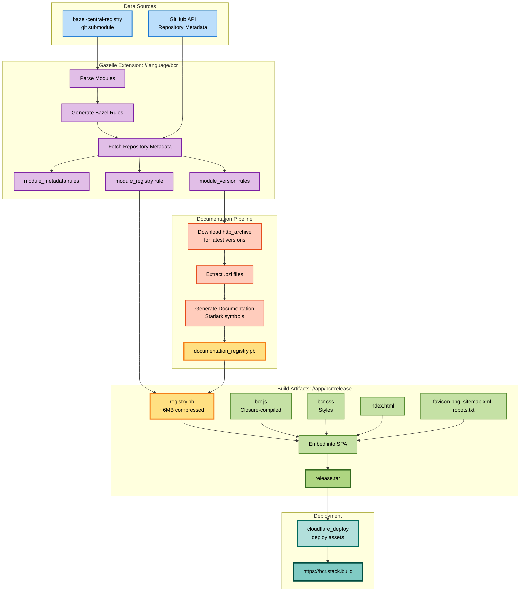

# centrl

## Build Pipeline

This repository contains:

1. a git submodule `data/bazel-central-registry` pointing to
   `https://github.com/bazelbuild/bazel-central-registry.git`
2. a gazelle extension that runs over `data/bazel-central-registry`:
   1. generates rules foreach module version
   2. fetches github repository metadata
   3. generates a `module_metadata` rule for each `{MODULE_NAME}` under
      `data/bazel-central-registry/modules/{MODULE_NAME}`.
   3. generates a `module_version` rule for each
      `{MODULE_NAME}/{MODULE_VERSION}` under
      `data/bazel-central-registry/modules/{MODULE_NAME}/{MODULE_VERSION}`.
   4. generates a `module_registry` rule at
      `data/bazel-central-registry/modules`.
   5. modifies the root `MODULE.bazel` file with additional http archives (for
      doc generation). 
3. a user interface for the BCR at `//app/bcr`.

To run gazelle:

1. `make bcr_init` to initialize the git submodule.
2. `make bcr_update` to update to the latest version.
3. `make bcr` to run the gazelle extension.  This is equivalent to `GITHUB_TOKEN=XXX bazel run //:bcr`.  You'll need a github api token to fetch necessary metadata from github.  Look the bazel gazelle rule to see various cache files.

To serve the UI:

- `bazel run //app/bcr:release`:
  - downloads a http archive for each latest version (having starlark files).
  - runs a different gazelle extension to collect `.bzl` files.
  - extracts documentation for all latest versions.
  - builds a single `registry.pb` containing the full state of the bazel central
    registry (and docs, this compresses to approx 6MB).
  - embeds that into the single-page application UI.
  - serves it up at :8080.
